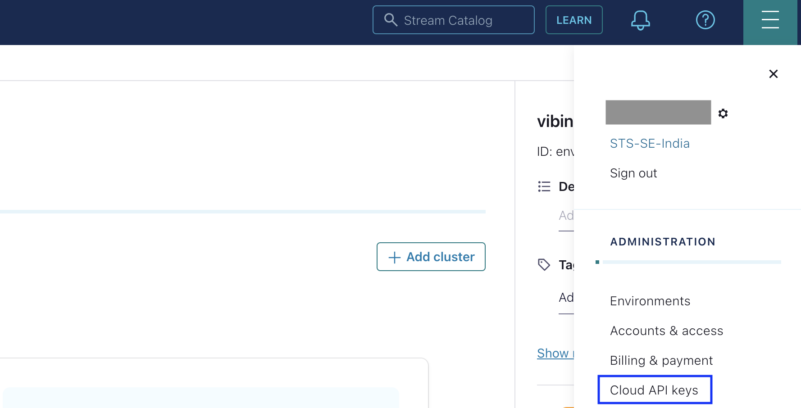
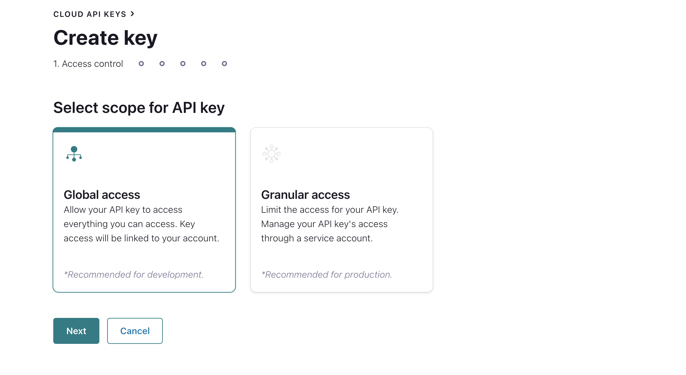
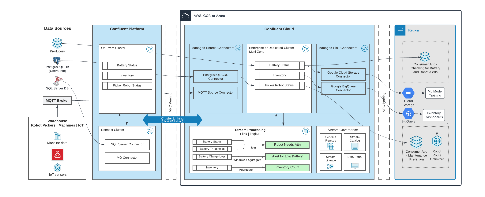
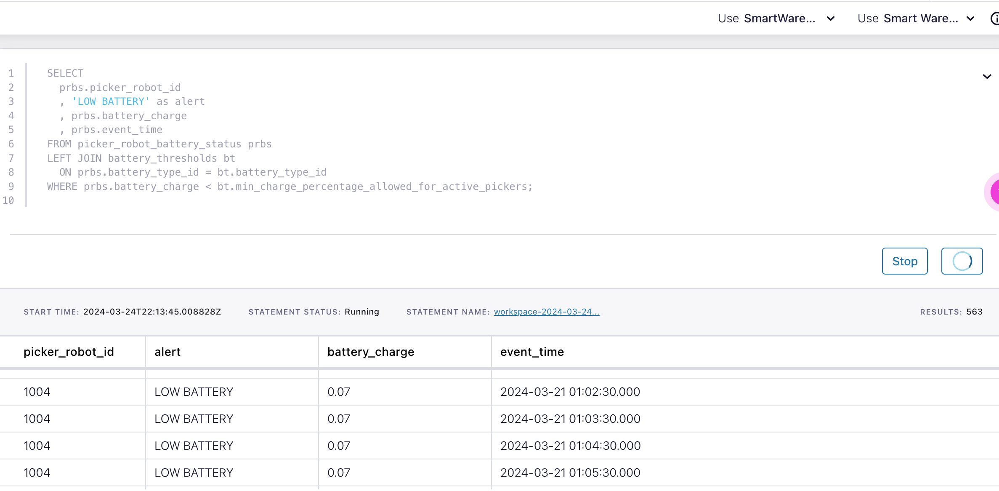
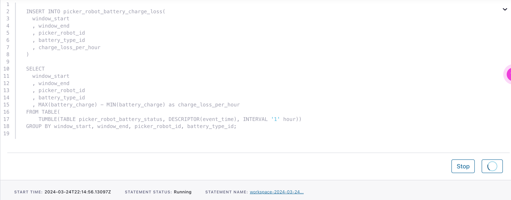
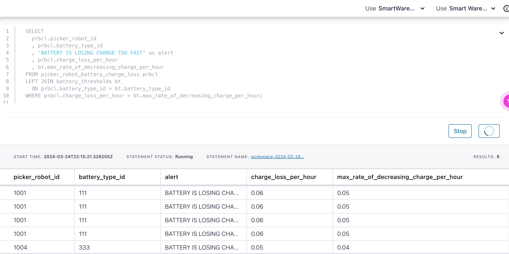
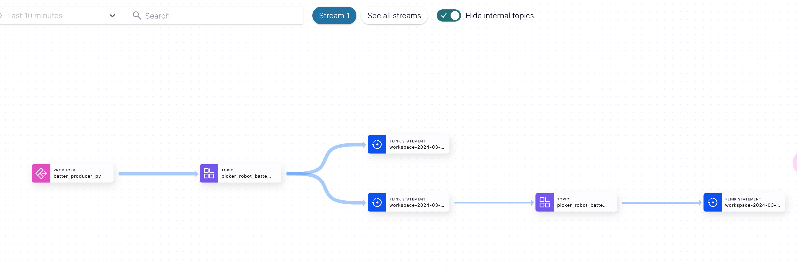

# Real-Time Data Streaming for Smart Warehouses

In the bustling world of retail, the concept of a smart warehouse is a game-changer. Picture this: automated systems seamlessly managing inventory counts and fulfillment orders, monitoring shelf weights, and orchestrating robot fleets for lightning-fast retrievals. With Confluent, smart warehouses can run on real-time data to power greater automation, efficiency, and cost savings. To overcome the above challenges, retailers can leverage Confluent Data Streaming Platform to stream, connect, process, and govern data at scale. In Confluent Cloud, stream processing with Flink or ksqlDB joins and enriches data streams to create ready-to-use data products: Alert for Low Battery, Inventory Count, and Robots Needs Attn.

In this demo, Flink SQL queries are used to create smart warehouse alerting for on-site maintenance crews when picker robot batteries are low or are decreasing at a rate that's too fast.

## Requirements

In order to successfully complete this demo you need to install few tools before getting started.

- If you don't have a Confluent Cloud account, sign up for a free trial [here](https://www.confluent.io/confluent-cloud/tryfree).
- Install Confluent Cloud CLI by following the instructions [here](https://docs.confluent.io/confluent-cli/current/install.html).
- Please follow the instructions to install Terraform if it is not already installed on your system [here](https://developer.hashicorp.com/terraform/tutorials/aws-get-started/install-cli)  
- Install Python on your local system by following the instructions [here] (https://realpython.com/installing-python).
 > **Note:** This demo uses Python 3.9.6 version

## Prerequisites

### 1. Confluent Cloud

1. Sign up for a Confluent Cloud account [here](https://www.confluent.io/get-started/).
2. After verifying your email address, access Confluent Cloud sign-in by navigating [here](https://confluent.cloud).
3. When provided with the _username_ and _password_ prompts, fill in your credentials.

   > **Note:** If you're logging in for the first time you will see a wizard that will walk you through the some tutorials. Minimize this as you will walk through these steps in this guide.

4. Create *Confluent Cloud API keys* by following the steps in UI. Click on the hamburger icon that is present on the right top section and click on Cloud API Keys.

<div align="center">
  
</div>

5. In the Access Control menu, select Global Access and click on the Next Button

 <div align="center">
  
  <br>
</div>

6. Now Click Add Key to generate API keys and store it as we will be using this key on terraform to deploy the infrastructure.

   > **Note:** This is different than Kafka Cluster API keys.


### 2. Setting up your Confluent Cloud Infrastructure

This demo uses Terraform to spin up the entire infrastructure and the resources that are needed for this demo. This terraform code creates the confluent cloud cluster, schema registry, Flink computing pool, Flink statements for creating two tables and data insertion and generates mock data that are needed for the demo.

  > **Note:** Total time of environment creation: approximate 12 minutes


1. Navigate to the repo's terraform directory.

  ```bash
  cd terraform
  ```

2. Update the `terraform/variables.tf` file for the following variables with your Cloud API credentials from the previous step.

  ```
  variable "confluent_cloud_api_key" {
    default = "Replace with your API Key created during pre-requesite"
  }

  variable "confluent_cloud_api_secret" {
    default = "Replace with your API Secret created during pre-requesite"   
  }
  ```

3. Initialize Terraform within the directory.

  ```
  terraform init
  ```

4. Use the following command to create the terraform plan which validates all the components described in the terraform script

  ```
  terraform plan
  ```

5. Apply the plan to create the infrastructure. This should take few minutes to setup.

  ```
  terraform apply
  ```

   > **Note:** Read the `main.tf` and the other component specific (.tf) configuration files [to see what will be created](./terraform/main.tf).

6. The following information - *Bootstrap URL, Cluster API Key, Cluster API Secret, Schema Registry URL, Schema Registry API Key, Schema Registry API Secret* are stored to producer.properties file in the python directory.

   > **Note:** The python files in the further steps in the demo will read the credentials directly from the producer.properties file.


### 3. Setting up Python Environment:

Install the below required modules in python to run the python scripts as directed in the following steps for implementation of the demo.

     ```
     pip3 install fastavro
     pip3 install confluent-kafka
     ```

## Architecture Diagram

This diagram provides an overview of the deployment architecture for a real-time smart warehouse in Confluent Platform and Confluent Cloud. This demo will only focused on part of this overall architecture,

<div align="center">
  
</div>


## Implementation
### 1. Generate sample data using python mock data generate code:

Run the following command to generate data continuously. With current setting, 10,000 records are created for battery status, with each record representing a battery status read in 60 seconds.

  ```bash
  python3 mock_data_generate.py
  ```

### 2. Flink statements
1. Alert when a robot picker battery is below the minimum threshold.

  ```
  SELECT
  prbs.picker_robot_id
  , 'LOW BATTERY' as alert
  , prbs.battery_charge
  , prbs.event_time

  FROM picker_robot_battery_status prbs
  LEFT JOIN battery_thresholds bt
  ON prbs.battery_type_id = bt.battery_type_id
  WHERE prbs.battery_charge < bt.min_charge_percentage_allowed_for_active_pickers;


  ```
  <div align="center">
    
  </div>


2. Alert when a robot picker battery is losing a charge faster than the maximum rate threshold.

  ```
  CREATE TABLE picker_robot_battery_charge_loss (
    `window_start` TIMESTAMP_LTZ(3)
    , `window_end` TIMESTAMP_LTZ(3)  
    , `picker_robot_id` INT
    , `battery_type_id` INT
    , `charge_loss_per_hour` DECIMAL(10,2)
  );

  INSERT INTO picker_robot_battery_charge_loss(
    window_start
    , window_end
    , picker_robot_id
    , battery_type_id
    , charge_loss_per_hour
  )
  SELECT
    window_start
    , window_end
    , picker_robot_id
    , battery_type_id
    , MAX(battery_charge) - MIN(battery_charge) as charge_loss_per_hour
  FROM TABLE(
  	TUMBLE(TABLE picker_robot_battery_status, DESCRIPTOR(event_time), INTERVAL '1' hour))
  GROUP BY window_start, window_end, picker_robot_id, battery_type_id;

  ```

  <div align="center">
    
  </div>

3. Create a Table to disable the buffering to get the results faster

  ```
  SELECT
    prbcl.picker_robot_id
    , prbcl.battery_type_id
    , 'BATTERY IS LOSING CHARGE TOO FAST' as alert
    , prbcl.charge_loss_per_hour
    , bt.max_rate_of_decreasing_charge_per_hour
  FROM picker_robot_battery_charge_loss prbcl
  LEFT JOIN battery_thresholds bt
    ON prbcl.battery_type_id = bt.battery_type_id
  WHERE prbcl.charge_loss_per_hour > bt.max_rate_of_decreasing_charge_per_hour;
  ```

  <div align="center">
    
  </div>


### Stream Lineage:

Once you have completed all the steps, you will have the complete stream lineage as shown below:

  <div align="center">
    
  </div>

You can access the Stream Lineage Feature inside Confluent Cloud by accessing the *Stream Lineage* menu in the left sidebar of the Confluent Cloud Dashboard.


## Other Features in Confluent Cloud

- High Availability
- Cloud Audit Logs
- Custom Connectors
- Encryption
- Stream Lineage
- Role Based Access Control (RBAC)

## Teardown

It's recommended that you delete any resources that were created during the demo so you don't incur additional charges. follow the steps below to stop generating additional data and stop all running services and drop the entire infrastructure spun up by terraform.


### Infrastructure:

Run the following command to delete all resources created by Terraform

  ```bash
  terraform destroy
  ```

# References

1. Intro to Stream Processing with Apache Flink - [tutorial](https://developer.confluent.io/courses/apache-flink/stream-processing/)
2. Schema Registry overview - [doc](https://docs.confluent.io/platform/current/schema-registry/index.html)
